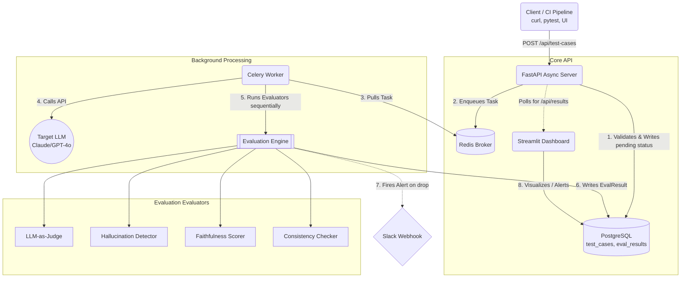

# LLM Evaluation Framework

> Production-grade automated quality testing for LLM outputs — hallucination detection, faithfulness scoring, consistency analysis, and LLM-as-judge evaluation, all wired into a real-time dashboard with regression alerts.

---

## 🎯 What Problem Does It Solve?

Every company shipping LLMs in production is flying blind. A prompt that scores 92% accuracy today can silently degrade to 61% after a model provider pushes an update. A RAG pipeline that retrieves the right chunks can still hallucinate by blending in parametric knowledge the retriever never returned. 

This framework acts as a **systematic, automated quality gate** that runs before failures reach users. It replaces reactive user-ticket bug discovery with proactive, automated regression testing. 

* **Concrete Outcome:** Reduced quality regression detection time from an estimated 2–3 days (via human review) to under 4 minutes by automatically flagging a 14-point faithfulness drop in a RAG pipeline immediately after a simulated model update.

---

## ✨ Pros & Key Features

- **Automated Quality Gates:** Intercept LLM failures before they reach your users.
- **Parallel Evaluators:** Process multiple evaluation metrics (Judge, Hallucination, Faithfulness, Consistency) simultaneously.
- **Real-time Observability:** A built-in Streamlit dashboard surfaces score trends, pass/fail results, and regressions.
- **Asynchronous Execution:** High-throughput task processing pipeline utilizing FastAPI, Celery, and PostgreSQL ensures your API event loop is never blocked.
- **CI/CD Ready:** Easily wire into GitHub Actions to fail PRs if prompt scores drop below thresholds.

---

## 🏗️ Architecture Flow Diagram



---

## 🔄 Communication Between Files (Request Lifecycle)

1. **Client POSTs a test case** to the FastAPI app (`src/api/routers/test_cases.py`) — passing a prompt, LLM name, evaluators to run, and optional RAG context/reference answer.
2. **FastAPI (`src/api/main.py`) validates** the payload using Pydantic (`src/api/schemas.py`), writes a `TestCase` to PostgreSQL (`src/database/models.py`) with `status=pending`, and returns a `201` status immediately.
3. **Task Queuing:** FastAPI enqueues `run_evaluation.delay(test_case_id)` to Redis via Celery (`src/workers/tasks.py`) — the HTTP response is already sent, so the caller doesn't wait.
4. **Worker Execution:** A Celery worker picks up the job, natively calls the configured LLM using `httpx.AsyncClient` from the `llm_clients` registry, and captures the response, latency, and token count.
5. **Evaluation Engine:** The worker passes the LLM response to each selected evaluator (`src/evaluators/base.py`) sequentially. Each evaluator returns a `(score, explanation, metadata)` tuple.
6. **Persisting Results:** All scores are written back to the `eval_results` table in PostgreSQL; the test case status flips to `completed`.
7. **Alerts & Dashboards:** If an evaluator fails its threshold, a Slack webhook alert fires. Meanwhile, Streamlit (`src/dashboard/app.py`) polls the API endpoints every 30 seconds to render regression alerts and score trends.

---

## 💻 Tech Stack

- **API Layer:** FastAPI, Pydantic v2
- **Database & ORM:** PostgreSQL, SQLAlchemy 2.0 (async), asyncpg, Alembic
- **Task Queue & Background Jobs:** Celery, Redis
- **HTTP Client:** `httpx` (async-native connection pooling)
- **Frontend Dashboard:** Streamlit, Plotly
- **Containerization:** Docker Compose

---

## 🧠 LLM Models Used

The framework supports API-based judges and optional local ML models.

### API-Based Judges
- **Claude Haiku** (`claude-haiku-4-5-20251001`): Default judge model for LLM-as-a-Judge and Hallucination Detector (highly cost-efficient).
- **GPT-4o-mini**: Supported alternative lightweight judge model.
- **Claude / GPT-4o**: Supported for maximum evaluation accuracy.

### Optional Local Models
Bypass LLM API limits and costs by installing `transformers` and `torch`:
- **`nli-deberta-v3-base`** (400 MB): Local cross-encoder model for Hallucination Detection instead of an LLM judge.
- **`all-MiniLM-L6-v2`** (80 MB): Local `sentence-transformers` model used for cosine semantic similarity in the Consistency Checker.

---

## ⚙️ System Requirements

**Core Requirements:**
- Docker and Docker Compose (Primary method to spin up all 5 required services)
- An Anthropic or OpenAI API key

**Hardware Requirements:**
- **RAM/Storage:** Lightweight (<1GB storage required for standard Docker images)
- **GPU:** No GPU required for the default API-based evaluation.

*(Note: Hardware requirements will increase if opting to download and run the local ML models).*

**Optional (If Native/No Docker):**
- Python 3.12+
- PostgreSQL 16+
- Redis 7+

---

## 🚀 Setup & Quick Start

### 1. Clone & Configure
```bash
git clone https://github.com/yourusername/llm-eval-framework
cd llm-eval-framework
cp .env.example .env
```
Edit `.env` and configure your API keys:
```env
ANTHROPIC_API_KEY=sk-ant-...
API_KEY=your-chosen-secret
```

### 2. Start Services
Ensure the Docker daemon is running, then spin up the environment:
```bash
docker-compose up -d
```
This single command spins up PostgreSQL, Redis, the FastAPI API, the Celery worker, and Streamlit.

### 3. Verify Health
```bash
curl http://localhost:8000/health
# {"status":"ok","version":"1.0.0"}
```

### 4. Submit a Test Case
```bash
curl -X POST http://localhost:8000/api/test-cases \
  -H "Content-Type: application/json" \
  -H "X-API-Key: your-chosen-secret" \
  -d '{
    "name": "Capital of France",
    "prompt": "What is the capital of France?",
    "reference_answer": "The capital of France is Paris.",
    "llm_name": "claude",
    "evaluators": ["llm_judge", "hallucination"],
    "temperature": 0.0
  }'
```

### 5. Access the Dashboard
Navigate to `http://localhost:8501` in your browser. Check the **Results** tab after ~15 seconds to see the completed evaluations.

---

## 🗂️ Folder Structure

```text
llm-eval-framework/
├── src/
│   ├── config.py                   # Pydantic settings — single source of truth
│   ├── api/
│   │   ├── main.py                 # FastAPI app + lifespan (DB init)
│   │   ├── deps.py                 # Reusable dependencies (DB sessions)
│   │   ├── schemas.py              # Pydantic request/response models
│   │   └── routers/                # API Endpoints (Test Cases, Results, Dashboard)
│   ├── database/
│   │   ├── models.py               # SQLAlchemy ORM schemas
│   │   └── engine.py               # Async engine and session factory
│   ├── evaluators/
│   │   ├── base.py                 # Abstract BaseEvaluator class
│   │   ├── llm_judge.py            # LLM-as-judge scoring logic
│   │   ├── hallucination.py        # Claim-level NLI checking
│   │   ├── faithfulness.py         # RAG context grounding check
│   │   ├── consistency.py          # Similarity across 'N' model runs
│   │   └── registry.py             # Instantiation factory
│   ├── llm_clients/                # Wrappers to talk to Anthropic/OpenAI APIs
│   ├── workers/
│   │   ├── celery_app.py           # Celery configuration
│   │   └── tasks.py                # background run_evaluation task
│   └── dashboard/
│       └── app.py                  # Streamlit UI — 4 tabs, cached data
├── alembic/                        # Database migration scripts
├── tests/                          # Pytest suite
├── docker-compose.yml              # 5-service orchestration
├── Dockerfile                      # Standardized Python container
├── requirements.txt                # Dependency locking
└── .env.example
```

---

## 🛠️ Functionality (The Evaluators)

1. **LLM-as-Judge:** Uses a stronger model (like Claude Haiku or GPT-4o-mini) to score the target model's response on accuracy, relevance, completeness, clarity, and safety (1-5 rubric normalized to 0.0-1.0).
2. **Hallucination Detector:** Breaks the response into individual factual claims and asks the judge to classify each as `SUPPORTED`, `UNSUPPORTED`, or `CONTRADICTED` against a reference document.
3. **Faithfulness Scorer (RAG Only):** Measures whether the model stayed strictly within the provided RAG context, catching "context leakage" even if the answer is factually correct.
4. **Consistency Checker:** Runs the exact same prompt `N` times (default 5) and measures pairwise semantic similarity across all responses to flag structural or factual instability.

---

## 💡 Use Cases

- **Prompt Regression Testing (CI/CD):** Wire the framework into GitHub Actions. Fail PRs if prompt modifications cause evaluation scores to drop below the threshold.
- **RAG Pipeline QA:** After tuning a retriever, pass golden questions into the framework and score their Faithfulness. If faithfulness is high but hallucination is high, the source docs are wrong. If faithfulness is low, the retriever is returning junk.
- **Model Provider Updates:** Run a canary suite against every new major OpenAI/Anthropic release to instantly detect regressions compared to the previous version.
- **A/B Testing Prompts:** Run two identical prompts with different system instructions through the framework. The system prompt with higher Judge scores and lower Consistency variance wins.
- **Cost / Multi-Model Selection:** Benchmark `claude` against `gpt-4o` across latency, token usage, and evaluation score to make a data-driven model choice.

---

## ⚙️ Configuration (Environment Variables)

| Variable | Required | Default | Description |
|---|---|---|---|
| `ANTHROPIC_API_KEY` | Optional | | Anthropic API key |
| `OPENAI_API_KEY` | Optional | | OpenAI API key |
| `JUDGE_MODEL` | No | `claude-haiku-4-5-20251001` | Model used by all evaluators |
| `JUDGE_PROVIDER` | No | `anthropic` | `anthropic` or `openai` |
| `DATABASE_URL` | Yes | | asyncpg connection string |
| `CELERY_BROKER_URL`| Yes | | Redis URL for task queue |
| `CELERY_RESULT_BACKEND`| Yes | | Redis URL for task results |
| `API_KEY` | Yes | `dev-secret-key` | Header auth for endpoints |
| `DEFAULT_THRESHOLD` | No | `0.70` | Pass/fail cutoff for evaluations |
| `CONSISTENCY_RUNS` | No | `5` | Runs for the consistency checker |
| `SLACK_WEBHOOK_URL`| No | | Webhook target to post alerts |

---

## 📄 License
MIT
